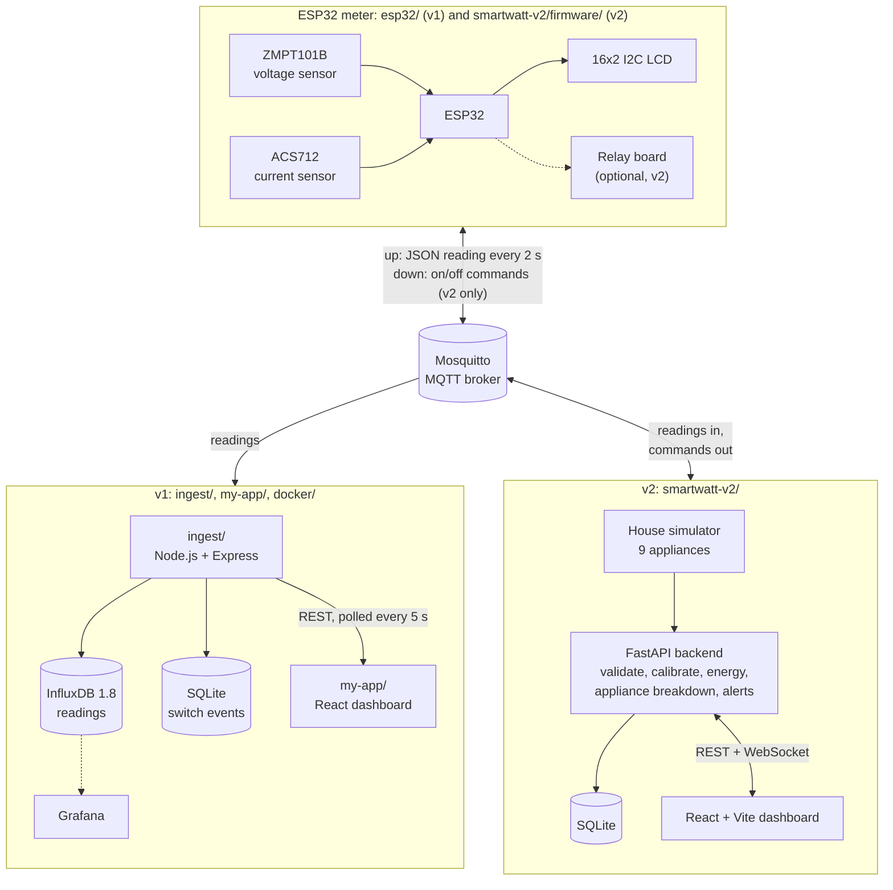

# Smart Watt: IoT energy meter with a live dashboard

**[Open the live demo](https://shyanwad-div.github.io/SmartWatt/)**: it runs in your browser on simulated data, with nothing to install and no sign-up.

Smart Watt measures how much electricity a home is using and shows it on a web dashboard as it happens. An ESP32 microcontroller reads a ZMPT101B voltage sensor and an ACS712 current sensor, calculates voltage, current, power and energy, shows them on a 16x2 LCD, and publishes a JSON reading over MQTT every 2 seconds. A backend service subscribes to those readings, stores them, checks them for problems such as overload, and serves them to the dashboard. The repository holds two versions. **v1** is a Node.js ingest service with InfluxDB and Grafana (run with Docker Compose) and a React dashboard. **v2** (`smartwatt-v2/`) is a Python FastAPI backend that adds an appliance-by-appliance breakdown, bill estimates, forecasts, more kinds of alerts and relay control. v2 also has a built-in house simulator, so it runs without the hardware, and that simulated version is the live demo.

**Related project:** [WattStream](https://github.com/SHYanwad-Div/wattstream), a Kafka + Flink SQL streaming pipeline that extends Smart Watt.

## Live demo

<https://shyanwad-div.github.io/SmartWatt/>

- It is the v2 dashboard built as a static website. The simulator and analytics were ported to JavaScript (`smartwatt-v2/frontend/src/demo/`), so everything runs in your browser and no server is involved.
- It shows three simulated homes. Choose **Explore as Homeowner** to see every appliance and switch them on and off, or **Explore as Utility analyst** for a read-only view across all three meters.
- The readings are simulated, not taken from the physical meter. Anything you change stays in your browser.

## Architecture



- Each reading is a JSON message on `smartwatt/readings/<device_id>` with `device_id`, `ts_ms`, `voltage_V`, `current_A`, `power_W` and `energyWh_total`. The v2 firmware also sends `pf` (power factor). Both versions use the same format, so the v2 backend also accepts readings from the v1 sketch.
- In v2, every reading goes through the same pipeline whether it comes from the ESP32 or the simulator, so the dashboard works the same way in both modes.
- In v2, on/off commands from the dashboard travel back through the broker on `smartwatt/cmd/<device_id>`, and the ESP32 switches the matching relay.
- Dotted lines are optional parts: the relay board (v2 firmware only) and Grafana (you add its InfluxDB data source yourself).
- v1 was Phase I and v2 was Phase II of a college project at AMC Engineering College (2025–26).

## Screenshots

> Screenshots will be added here. Save each image in `docs/screenshots/` and replace its row with ``.

| Placeholder | What it should show |
|---|---|
| `docs/screenshots/hardware.jpg` | The ESP32 meter: sensors, LCD and wiring |
| `docs/screenshots/v2-dashboard.png` | v2 dashboard: live power chart, appliance breakdown and 3D house |
| `docs/screenshots/v2-assistant-billing.png` | v2 Energy Assistant and bill estimate |
| `docs/screenshots/v1-dashboard.png` | v1 React dashboard: hourly power chart and detected events |

## Hardware

| Part | What it does | ESP32 pins |
|---|---|---|
| ESP32 development board | Reads the sensors, connects to Wi-Fi, talks MQTT | Arduino board setting: **ESP32 Dev Module** |
| ZMPT101B voltage sensor module | Measures the AC mains voltage | GPIO 35 (ADC1) |
| ACS712 current sensor module | Measures the current drawn by the load (Hall-effect sensor) | GPIO 34 (ADC1) |
| 16x2 LCD with I2C backpack | Shows readings on the device (I2C address 0x27, or 0x3F on some modules) | SDA 21, SCL 22 |
| Relay board, 4 channels (optional, v2 firmware only) | Lets the dashboard switch AC, water heater, fan and lights | GPIO 26, 27, 25, 33 |

Firmware libraries: PubSubClient, ArduinoJson (7.x for the v2 firmware) and LiquidCrystal_I2C. The wiring notes are at the top of `smartwatt-v2/firmware/smartwatt_v2/smartwatt_v2.ino`.

> [!WARNING]
> The voltage sensor connects to 230 V AC mains. Wire it only with the supply switched off, and never touch the circuit while it is powered.

## Tech stack

| | v1 | v2 |
|---|---|---|
| Device | ESP32, Arduino C++ | ESP32, Arduino C++, plus NTP time and relay control |
| Messaging | MQTT, Eclipse Mosquitto 2 (Docker) | MQTT (paho-mqtt), same topics |
| Backend | Node.js 18, Express, MQTT.js, node-influx, sqlite3, nodemailer | Python 3.11+, FastAPI, Uvicorn, NumPy, PyJWT |
| Storage | InfluxDB 1.8 (readings), SQLite (switch events) | SQLite |
| Dashboard | React 19 (Create React App), MUI, Chart.js; Grafana | React 18, Vite, Chart.js, three.js |
| Live updates | REST, polled every 5 s | REST + WebSocket |
| Alerts | Telegram, email | Dashboard, email, webhook, Telegram |
| Deployment | Docker Compose | `run.ps1` / `run.sh`; static demo via GitHub Actions and GitHub Pages |

## Features in v2

- **True-RMS measurement.** For each reading, the ESP32 takes 2000 samples of both sensors, removes the DC offset, and calculates RMS voltage, RMS current, real power and power factor.
- **One pipeline for real and simulated data.** Each reading is validated, calibrated, added up into kWh, saved to SQLite and pushed to the dashboard over a WebSocket, whether it came from the ESP32 or from the simulator of 9 household appliances.
- **Appliance breakdown (NILM).** The backend watches for step changes in total power (at least 30 W, lasting 3 readings) and matches each step to an appliance by its rated power. Load it cannot match is shown as "Other" instead of being guessed.
- **Alerts.** Overload, low or high voltage, going over a daily kWh budget, unusual spikes (a median-based z-score), and power still being drawn when everything is off. Alerts show on the dashboard and can also be sent by email, webhook or Telegram.
- **Bill estimate.** Telescopic tariff slabs with a fixed charge and tax. The default slabs are Karnataka-style domestic rates and can be edited on the Settings page.
- **Forecasts.** Power for the next 2 hours (ridge regression on time-of-day patterns, or a smoothed average when there is less than 2 hours of data) and a projection of the month's total kWh.
- **Control and automations.** Appliances can be switched from the dashboard, the assistant, or rules such as "power above a limit", "daily budget exceeded", "time of day" and "appliance left on too long". With hardware, the command goes to the ESP32's relays over MQTT.
- **Sign-in with roles.** Homeowner, utility analyst (read-only view across all meters) and admin, using JWT tokens and PBKDF2-hashed passwords.
- **Energy Assistant.** A chat panel that answers questions about usage, bills and tariff slabs, and can switch appliances. It is rule-based (keyword matching); there is no AI model or API key.
- **Also:** a 3D view of the house (three.js) with live appliance states, daily reports with CSV export, dark mode, and a layout that works on phones.

## How to run

The commands are for Windows PowerShell and start from the repository root.

```powershell
git clone https://github.com/SHYanwad-Div/SmartWatt.git
cd SmartWatt
```

### v2 on your PC, without hardware

Needs Python 3.11+ and Node.js 18+.

```powershell
cd smartwatt-v2
.\run.ps1
```

On the first run, the script copies `.env.example` to `.env`, installs the Python packages and builds the dashboard. Then open <http://localhost:8000> and sign in with one of the demo accounts the script prints. The API documentation is at <http://localhost:8000/docs>. Press Ctrl+C to stop.

If PowerShell says that running scripts is disabled, start it with `powershell -ExecutionPolicy Bypass -File .\run.ps1` instead.

To work on the dashboard with hot reload, run the backend and the Vite dev server in two terminals, both starting in `smartwatt-v2`:

```powershell
python -m pip install -r requirements.txt
python -m uvicorn app.main:app --app-dir backend --reload
```

```powershell
cd frontend
npm install
npm run dev
```

The dev server runs at <http://localhost:5173> and forwards `/api` requests to the backend on port 8000.

### v2 with the ESP32 meter

1. Start an MQTT broker. This uses the Mosquitto service from the v1 Compose file and needs Docker Desktop running:

   ```powershell
   docker compose -f docker\docker-compose.yml up -d mosquitto
   ```

2. Create the firmware settings file from the example, then fill in your Wi-Fi name and password, `MQTT_HOST` (your PC's IPv4 address, shown by `ipconfig`) and a device id. `secrets.h` is git-ignored, so these values stay off GitHub.

   ```powershell
   Copy-Item smartwatt-v2\firmware\smartwatt_v2\secrets.example.h smartwatt-v2\firmware\smartwatt_v2\secrets.h
   notepad smartwatt-v2\firmware\smartwatt_v2\secrets.h
   ```

3. Open `smartwatt-v2\firmware\smartwatt_v2\smartwatt_v2.ino` in the Arduino IDE. Install the ESP32 board package and the libraries PubSubClient, ArduinoJson 7.x and LiquidCrystal_I2C, choose **ESP32 Dev Module**, and upload.

4. Start v2 with MQTT turned on:

   ```powershell
   cd smartwatt-v2
   .\run.ps1 -Source both    # simulator + ESP32; use -Source mqtt for the ESP32 only
   ```

5. Calibrate: connect a known resistive load, such as a 100 W bulb, and compare the readings with a multimeter. Adjust `VOLTAGE_CAL` and `CURRENT_CAL` in the firmware, then fine-tune the gains on the Settings page.

If the ESP32 joins Wi-Fi but cannot reach the broker, check that Windows Firewall allows incoming connections on TCP port 1883.

### v1 stack (Docker, Node.js and React)

```powershell
cd docker
docker compose up -d --build
Invoke-RestMethod http://localhost:3000/health
```

This starts Mosquitto (port 1883), InfluxDB 1.8 (8086), Grafana (3001) and the ingest API (3000). Then start the React dashboard in a second terminal:

```powershell
cd my-app
npm install
$env:PORT = "3002"   # port 3000 is already used by the ingest API
npm start
```

- Open <http://localhost:3002>. The **Simulate** button sends a test reading to the ingest API, which is handy when no ESP32 is connected.
- Grafana is at <http://localhost:3001>. To chart the `readings` measurement, add an InfluxDB data source with URL `http://influxdb:8086` and database `smartwatt`.
- The optional alert and weather settings (Telegram, SMTP, OpenWeather) are environment variables of the `ingest` service; they are listed at the top of `ingest/index.js`.
- Stop the stack with `docker compose down`, run in the `docker` folder.

The original v1 sketch is in `esp32/smart_iot_energy_meter/`. For new hardware, use the v2 firmware: it sends the same message format and measures true RMS.

### Live demo deployment

`.github/workflows/deploy-demo.yml` builds `smartwatt-v2/frontend` with `npm run build:demo` and publishes it to GitHub Pages whenever a push to `main` changes `smartwatt-v2/frontend/`. It can also be run by hand from the **Actions** tab (**Deploy live demo**, then **Run workflow**). To try the demo build locally:

```powershell
cd smartwatt-v2\frontend
npm install
npm run dev:demo
```

## Repository layout

```text
esp32/          v1 ESP32 sketch (Arduino C++)
ingest/         v1 Node.js service: MQTT -> InfluxDB and SQLite, REST API, alerts
docker/         Docker Compose for v1: Mosquitto, InfluxDB, Grafana, ingest
my-app/         v1 React dashboard (Create React App)
smartwatt-v2/   v2: FastAPI backend, React + Vite dashboard, ESP32 firmware
.github/        GitHub Actions workflow that publishes the live demo
```

`smartwatt-v2/README.md` has more detail on v2: the API routes, configuration options and test notes.

## Limitations

- The live demo and the default local run use simulated data. Real readings need the ESP32 meter, calibrated for its own sensors.
- The appliance breakdown is an estimate made from the total power alone, because there is one meter rather than one per appliance. When several appliances switch at the same moment, they look like one bigger appliance until that load switches off again.
- The v1 sketch averages the raw sensor samples. On an AC signal that average is close to the sensor's DC offset rather than the actual voltage or current, which is why the v2 firmware calculates true RMS instead.
- It is set up for a home-network demo: CORS allows every origin and the demo accounts have known passwords, so it needs hardening before being exposed to the internet.
