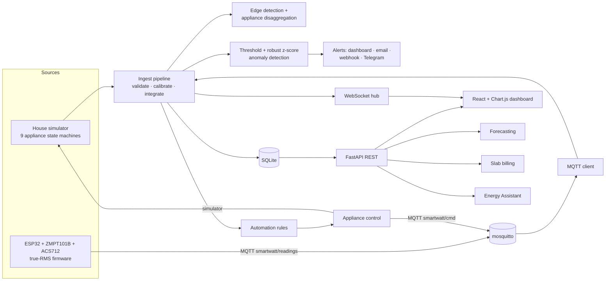

# Smart Watt v2 — IoT energy consumption monitoring

Phase-II build of the *Smart Watt – IoT-based Solution for Energy Consumption and
Monitoring* project (AMC Engineering College, 2025-26). It implements the core
system from chapters 3–6 plus every item from **section 7.5, Future
Enhancements**. By default it runs entirely on synthetic data, and it accepts a
real ESP32 meter without changing anything else.

The Phase-I prototype (Node ingest, InfluxDB, Grafana, the first ESP32 sketch)
sits alongside this folder in `../docker`, `../ingest`, `../my-app` and
`../esp32`. It is left unchanged.

## Live demo (no server)

The dashboard also builds as a fully static site: the simulator, appliance detection,
alerts, billing, forecasts, automations and the Energy Assistant are ported to JavaScript
(`frontend/src/demo/`) and run inside the visitor's browser. Every visitor gets a private
house, their changes stay on their device, and nothing needs hosting beyond static files.

```bash
cd frontend
npm run dev:demo        # try it locally
npm run build:demo      # static site in frontend/dist-demo
```

`.github/workflows/deploy-demo.yml` publishes that build to GitHub Pages on every push to
`main` (enable Settings -> Pages -> Source: GitHub Actions once). On first load it replays
today from midnight plus about a month of daily totals, so charts, bills and forecasts are
populated immediately.

## Quick start

Requires Python 3.11+ and Node 18+.

```powershell
.\run.ps1            # Windows
```
```bash
./run.sh             # Linux / macOS
```

Open <http://localhost:8000> and sign in:

| Account | Password | Role |
|---|---|---|
| `home` | `home123` | Homeowner: view, control appliances, settings, automations |
| `utility` | `utility123` | Utility analyst: read-only, portfolio across every meter, billing |
| `admin` | `SW_ADMIN_PASSWORD` in `.env` (default `admin123`) | Everything |

To use real hardware, run `.\run.ps1 -Source both` (simulator and ESP32) or `-Source mqtt`.

## Architecture



Every reading goes through the same pipeline, whether it came from the simulator or the hardware.
That's why the dashboard looks and behaves the same in both modes.

## What is implemented

| Report item | Where |
|---|---|
| Voltage, current, power, energy measurement (Table 4.3) | `backend/app/ingest/pipeline.py`, firmware |
| Calibration and moving-average filtering (§3.2) | pipeline calibration gains (Settings page); 5-sample display filter |
| MQTT transmission (§3.1) | `ingest/mqtt_client.py`, wire-compatible with the Phase-I sketch |
| Time-series storage, data logging | SQLite `readings`, `appliance_samples`, `daily_energy`, `events`, `alerts` |
| Real-time dashboard over REST + WebSocket (§3.3) | `frontend/`, `/api/ws/{device}` |
| Multi-level alerts, dashboard + external channels (§3.3) | `alerts.py`; overload, voltage, daily budget, statistical spike, phantom load |
| Bill estimation (§2.5) | `billing.py`, telescopic slabs, fixed charge, tax |
| Multi-device monitoring (Table 4.3) | device registry, meter selector, Portfolio page |
| **7.5** Appliance-level monitoring | `analytics/events.py` + `analytics/disaggregation.py` (NILM on the aggregate signal) |
| **7.5** Predictive analytics | `analytics/forecast.py`: ridge regression on daily Fourier terms, month-end projection |
| **7.5** Smart load control | `control.py`, dashboard Turn off/on, firmware relays |
| **7.5** Customisable widgets, user-defined thresholds | Settings page (validated server-side) |
| **7.5** Role-based dashboards | `auth.py`: homeowner / utility / admin, JWT |
| **7.5** Energy Assistant (Fig 7.4) | `assistant.py`, offline intent engine; answers usage, bill and slab questions and switches appliances |
| **7.5** Mobile application integration | responsive layout + installable PWA manifest |
| Interactive 3D home | `frontend/src/components/House3D.jsx`: three.js cutaway house with live appliance animations; click an appliance to switch it |
| Automations | power above, over daily budget, time of day, appliance left on → turn off/on or notify |
| Reports and export | daily energy/cost, CSV export |

## Measured results

These are measured by driving the running application, not estimated:

- **Disaggregation:** 0.849 mean attribution accuracy against simulator ground truth
  (8 simulated hours × 3 seeds), as shipped. Turning off the cold-start correction scores
  0.877 on this test, but then load that was already running when the meter started stays
  unattributed indefinitely, so the correction stays on. A clean 500 W step published over MQTT is logged as one
  event labelled *Washing Machine* at confidence 1.0.
- **Energy integration:** a constant 1200 W for one hour integrates to exactly
  1.200000 kWh. A burst of 24 readings delivered 150 ms apart (a broker backlog)
  integrates on the device clock: 4.100 Wh against 4.100 Wh expected.
- **Billing:** at 150 kWh the energy charge is 50×4.10 + 50×5.65 + 50×7.35 = ₹855.00,
  exactly. Crossing a slab boundary costs more than staying inside one.
- **Cold start:** load present when the meter starts sits in "unattributed" for about
  a minute, until reconciliation assigns it. The dashboard says so rather than naming a small
  appliance as the top consumer.
- **Known limitation, simultaneous switching:** when several appliances switch within the
  same few seconds (for example "turn everything on"), they produce one merged step, which is
  attributed to the closest single appliance. In one test, AC + lights + fan read as the water
  heater, and the state corrected itself at that load's next off-step. Matching combinations of
  2–3 appliances was tried and rejected: steady-state accuracy fell from 0.877 to 0.837, and on the
  merged-step scenario it fixed one seed while breaking another.
- **Relay switch-offs:** an off-step that follows a dashboard, assistant or automation
  switch-off is labelled with that appliance (confidence 1.0 in the MQTT test), not "Unidentified".

## Configuration

Copy `.env.example` to `.env` (the run scripts do this). Key settings:

| Variable | Default | Meaning |
|---|---|---|
| `SW_SOURCE` | `sim` | `sim`, `mqtt` or `both` |
| `SW_MQTT_HOST` / `SW_MQTT_PORT` | `localhost` / `1883` | broker for hardware |
| `SW_JWT_SECRET` | empty | empty = random secret generated into `data/.jwt_secret` |
| `SW_INGEST_KEY` | empty | key for `POST /mock_reading` via `X-Device-Key` |
| `SW_SMTP_*`, `SW_WEBHOOK_URL`, `SW_TELEGRAM_*` | empty | alert channels; enable them in Settings |

Thresholds, tariff slabs, widget layout and calibration are edited on the Settings page.
They are stored in the database and validated by the server.

## Hardware

1. Wire the sensors as described in the header of `firmware/smartwatt_v2/smartwatt_v2.ino`.
2. Copy `secrets.example.h` to `secrets.h` and fill in your WiFi, broker IP and device id.
3. Install PubSubClient, ArduinoJson 7 and LiquidCrystal_I2C, then flash with Arduino IDE (board: ESP32 Dev Module).
4. Run a broker (`mosquitto -v`, or `../docker/docker-compose.yml`) and start with `-Source both`.
5. Calibrate: put a known resistive load on the meter, compare with a multimeter, and adjust
   `VOLTAGE_CAL` and `CURRENT_CAL` in the firmware. Fine-tune with the gains on the Settings page.

To test without flashing anything, send a reading over HTTP:

```bash
curl -X POST http://localhost:8000/mock_reading -H "Content-Type: application/json" \
  -H "X-Device-Key: $SW_INGEST_KEY" \
  -d '{"device_id":"esp32-test","voltage_V":230,"current_A":2.1,"power_W":480}'
```

## API

Interactive documentation is at <http://localhost:8000/docs>. The main routes:

`POST /api/auth/login` · `GET /api/devices` · `GET /api/live/{dev}` · `GET /api/readings/{dev}?range=1h` ·
`GET /api/appliances/{dev}` · `POST /api/appliances/{dev}/control` · `GET /api/events/{dev}` ·
`GET /api/alerts/{dev}` · `GET /api/billing/{dev}` · `GET /api/forecast/{dev}` ·
`POST /api/assistant/{dev}` · `GET|PUT /api/settings` · `/api/automations/...` ·
`GET /api/reports/{dev}/daily` · `GET /api/reports/{dev}/export.csv` · `GET /api/portfolio` ·
`WS /api/ws/{dev}?token=…`

## Development

```bash
# backend with auto-reload
python -m uvicorn app.main:app --app-dir backend --reload
# dashboard with hot reload on :5173 (proxies /api to :8000)
cd frontend && npm run dev
```

## Security notes

- The Phase-I `../docker/docker-compose.yml` contains a live Telegram bot token, a chat id and
  an OpenWeather key, and `../esp32/...ino` contains WiFi credentials. Rotate these before
  publishing the repository.
- CORS is open for LAN demos. Restrict `allow_origins` in `backend/app/main.py` before deploying.
